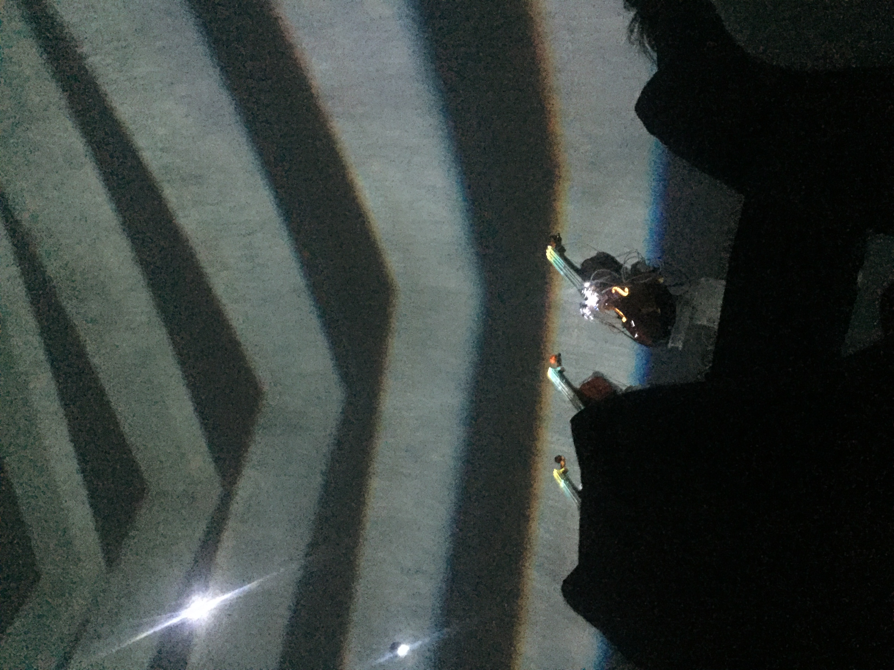

# Nom de l'exposition
David Gardener & Greg Debicki
Empty Vessels 

# Qui

# Quand
Réalisé depuis 2019.

Présenté uniquement entre le 26 avril 2022 aux 30 avril 2022
# Où
Sociétée des art technologiques
1201 Boul St-Laurent

# Description
* Une oeuvre audiovisuelle 
* trois violoncelles enclavés robotisé
* La robotique contrôlée par un réseau de neurones issu de l’intelligence artificielle 
* Performance devant un public en tant réel
* Des immersions sont projetés 
* Musique controllé mécaniquement par l'IA 
* Musique en harmonie avec les projections.
* Le public cible est très polyvalent.
* Les adeptes d'intelligences artificielles, musiques et immersions visuels seront les principaux visé par cette installation.

# Mise en espace

* Plusieurs trou dans le dôme cache les projecteurs. 
* La régie est dans le dôme, caché en arrière. 
* Un meuble abritant les fils abrite les 3 violoncelles à plus où moins 3 à 4 mètre du dôme.

# Aspect technique
Aspect TECHNIQUE COMPLET:
* Les violoncelles sont reliés par une quantité assez considérable de fils électrique à un mécanisme qui provoquent la pressions sur les cordes du violoncelles. 
* Un mécanisme monte et descend le baton du violoncelle afin d'aller chercher exactement la note. 
* La lumière verte est l'endroit ou un mécanisme fais frotter les cordes. Tout ce mécanisme complet est calculé et syncronisé vers les 3 violoncelles par une intelligence artificielle pour recréée une expérience musicale différente après chaque visite. 
* La régie détiens les consoles d'éclairage et de son avec un logiciel de montage. 
* L'oeuvre tient compte de l'autonomie et l'improvisation de l'intelligence artificiel pour ce qui est de la musique qui s'armonise au visuel. 
* Les projecteurs sont positionné stratégiquement pour prendre l'étendue du dôme sans faire de point mort et les superpositions sont mappé.

# Appréciation
* Démarcation importante des autres immersions par rapport à l'autonomie de l'intélligence artificielle. 
* Fascination des calculs et génération visuel et auditif
* Utilisation de vrai instrument plutôt qu'un synthétiseur

# Médiagraphie
Société des Arts Technologiques
https://sat.qc.ca/fr/evenements/empty-vessels
FAQ Oeuvre:
https://sat.qc.ca/sites/default/files/empty_vessels_par_eric_cohen_-_effet_pogonat.mp3