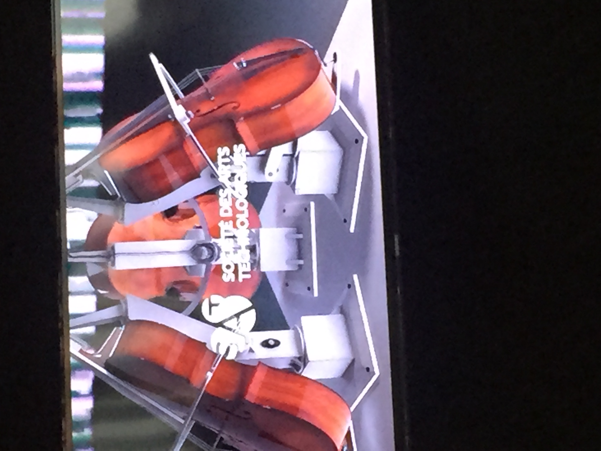
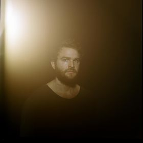
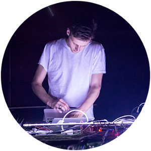
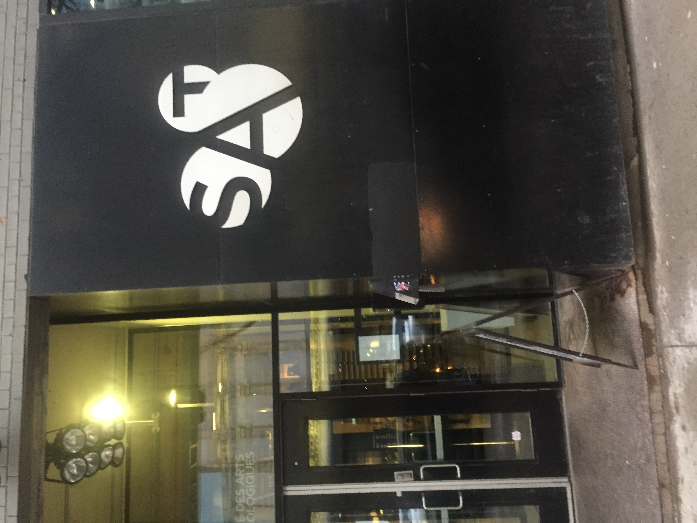
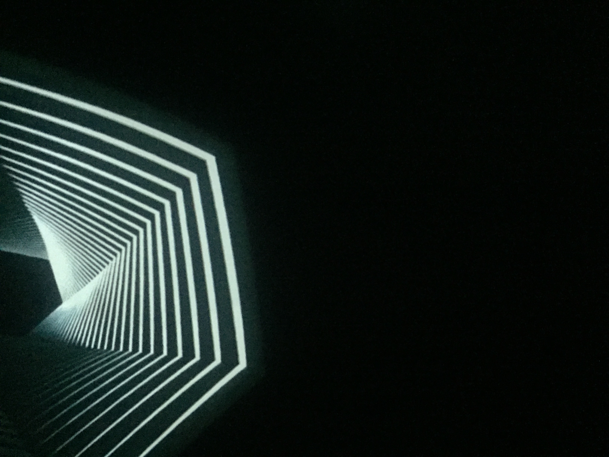
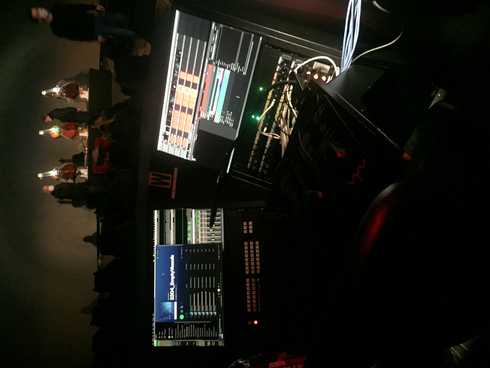
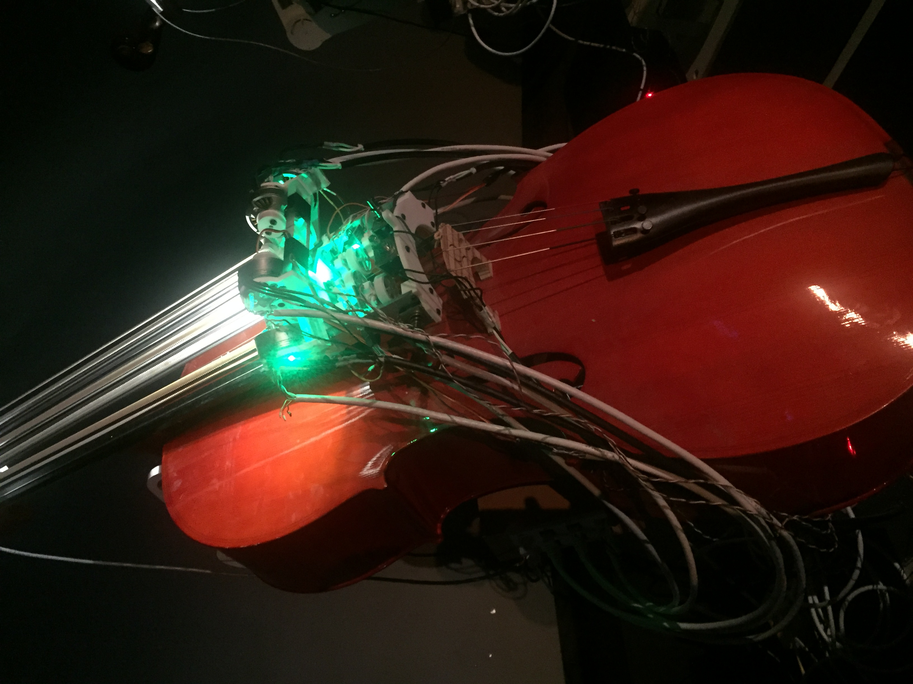

# Nom de l'exposition

Empty Vessels 

# Qui

David Gardener & Greg Debicki
# Quand
Réalisé depuis 2019.

Présenté uniquement entre le 26 avril 2022 aux 30 avril 2022
# Où

Sociétée des art technologiques
1201 Boul St-Laurent
# Description
Empty Vessels est une oeuvre audiovisuelle installative qui met en scène trois violoncelles enclavés dans les appendices de structures robotiques. La robotique est contrôlée par un réseau de neurones issu de l’intelligence artificielle élaboré pour composer et performer devant un public afin de justifier son existence. Des immersions sont projetés dans le dôme pour accompagner la musique controllé mécaniquement des violoncelles par l'intelligence artificielle. La musique est Plus ou Moins en coïncidence avec l'immersion visuel. Le public cible est très polyvalent. Les adeptes d'intelligences artificielles, musiques et immersions visuels seront les principaux visé par cette installation.

# Mise en espace

Plusieurs trou dans le dôme cache les projecteurs afin de projeter des animations génératives. La régie est dans le dôme, tout en arrière des spectateurs et des violons pour éviter tout pollution visuelle. Un meuble avec une quantité assez remarquable de fils abrite les 3 violoncelles à plus où moins 3 à 4 mètre du dôme.

# Aspect technique
Les violoncelles sont reliés par une quantité assez considérable de fils électrique à un mécanisme qui provoquent la pressions sur les

# Système
